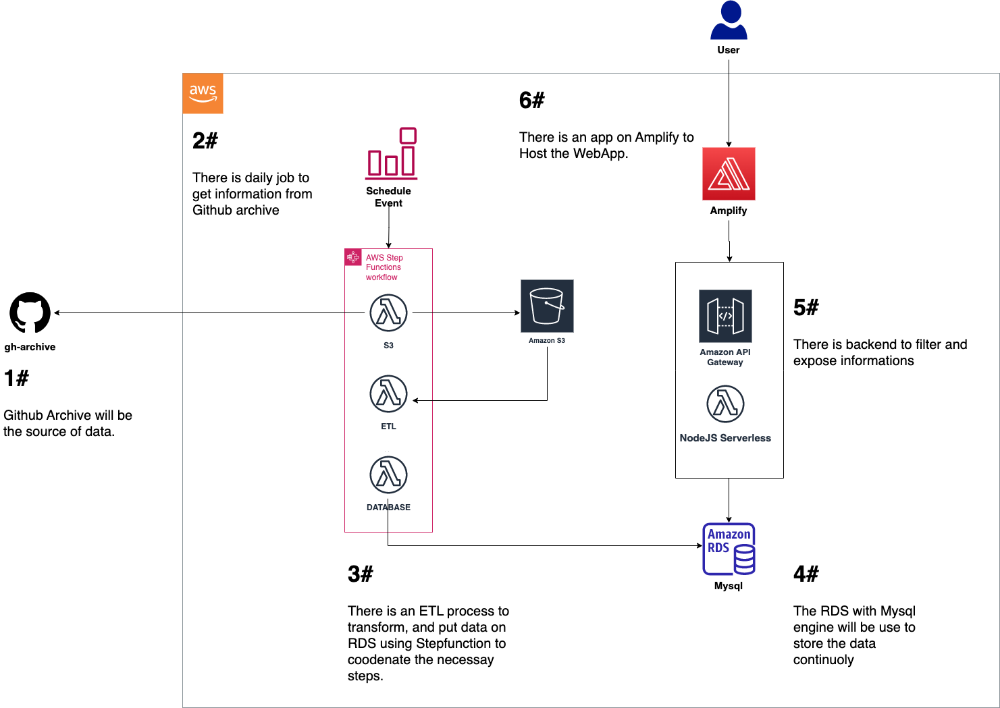

# Architecture
The ideia of this project is to build a small product to compare similatiry beetween two or more opensources projects.

# Artifacts
### New Amplify Project
    - amplify init 
    - amplify add hosting
    - amplify add api
### Exist Environment
    - amplify pull --appId d31mpz82izrv4q --envName staging
### Deploy/Update Resources
    - amplify push --y
### Remove Resources
    - amplify remove api [resource id]
    - amplify remove function [resource id]
### Local teste
    - amplify function invoke proxyintegration GET /stars
# Referencies
    - https://docs.amplify.aws/cli/hosting/hosting/
    - https://docs.amplify.aws/lib/restapi/update/q/platform/react-native/#put-data
    - https://github.com/safak/youtube2022/tree/react-mysql
    - https://docs.amplify.aws/cli/restapi/override/
